# python自动化之——获取钉钉群所有人的昵称

>

## 楔子

　　精神小伙`沙大柱`入职了一家新公司，该公司所有成员都在`钉钉`群。 

　　一天，`沙大柱`的上级`沙小牛`布置了任务：大柱，你把群里所有人的名称导出来吧，我不会操作。

　　大柱表示：没问题，你把我升级成管理员吧，我去后台看看怎么导出。

　　但大柱万万没想到，他的上级沙小牛还是不会。于是，大柱只好使出浑身功力，为领导无脑前行。

　　大柱先对钉钉进行了一波操作，发现钉钉群成员列表下方的"查看更多"可以展开更多成员，但可惜每次都只加载有限数量，而公司成员实在太多……

　　历经“大战”，大柱终于利用 `python` 自动化直接操纵钉钉软件，将所有成员展开，并复制出来。


## 环境准备

- windows 10
- 钉钉 6.5.50
- python3.11

python 依赖：

- PyAutoGUI==0.9.53

PS.
pyautogui 是一个python库，能够操纵电脑，模拟鼠标、键盘的操作。
用这个库的目的是，解放双手，完成进入钉钉群，点击加载更多成员的一系列操作。

## 功能实现



### 搜索钉钉群

```python

class SearchGroupAction(object):

    def __init__(self, name, win: Win32Window):
        self.name = name
        self.win = win

    def run(self):
        w = self.win
        x = w.left + w.width / 2
        y = w.top + 10

        Clipboard.setText(self.name)
        pyautogui.click((x, y))
        time.sleep(0.5)
        Clipboard.paste()
        time.sleep(1)
        pyautogui.hotkey("enter")
        time.sleep(0.5)
```

### 疯狂点击“查看更多”按钮

```python
class ParseMemberInfoAction(object):
    def __init__(self, win_ding: Win32Window):
        self.win = win_ding
        self.win_setting = None
        self.result_text = ''

    def run(self):
        w = self.win
        # 点击设置，访问设置对话框
        pyautogui.click((w.right - 35, w.top + 65))
        time.sleep(1)
        win_setting = pyautogui.getActiveWindow()
        pyautogui.hotkey('ctrl', 'a')
        pyautogui.hotkey('ctrl', 'c')
        text = Clipboard.getText()
        # 取消选中
        pyautogui.click(w.right - 100, w.top + 100)
        if '查看更多' in text:
            img = pyautogui.screenshot(
                region=(win_setting.left, win_setting.top, win_setting.width, win_setting.bottom))
            box: Box = pyautogui.locate(f'./res/chakangengduo.png', img)
            pyautogui.click(win_setting.left + box.left + box.width / 2, win_setting.top + box.top + box.height / 2)
            pyautogui.vscroll(-3000)

            time.sleep(0.5)
            # 滚动到底部后，此时”查看更多“的坐标固定了。下次点击可以不用再截图查坐标
            img = pyautogui.screenshot(
                region=(win_setting.left, win_setting.top, win_setting.width, win_setting.bottom))
            box: Box = pyautogui.locate(f'./res/chakangengduo.png', img)

            pyautogui.click(win_setting.left + box.left + box.width / 2, win_setting.top + box.top + box.height / 2)
            while True:
                pyautogui.hotkey('ctrl', 'a')
                pyautogui.hotkey('ctrl', 'c')
                text = Clipboard.getText()
                # 取消全选
                pyautogui.click()
                if '查看更多' not in text:
                    print(text)
                    self.result_text = text
                    return self
                pyautogui.click(win_setting.left + box.left + box.width / 2, win_setting.top + box.top + box.height / 2)
                pyautogui.vscroll(-3000)
                time.sleep(1)

        return self
```

执行：

```python

def main():
    pywindow = pyautogui.getActiveWindow()
    w = pyautogui.getWindowsWithTitle('钉钉')[0]
    w.activate()
    w.maximize()
    print(w)

    SearchGroupAction("xxx群", w).run()
    pmc = ParseMemberInfoAction(w).run()

    time.sleep(3)
    # 恢复命令行界面
    pywindow.activate()

```

[点击查看代码](./code/test_collect_member_ding.py)