# python自动化之——获取钉钉群所有人的钉钉号

>

## 楔子

　　`沙大柱`在上一篇文章中被上级领导`沙小牛`的奇葩要求爆锤，他才刚刚给沙小牛提供成员名单，这沙小牛就布置了新的任务。

　　“大柱啊，你把钉钉号也导出来吧，我有用。”

　　于是，沙大柱又拿起了python，开启了疯狂模式。


---
## 环境准备

- windows 10
- 钉钉 6.5.50
- python3.11

python 依赖：

- PyAutoGUI==0.9.53
- once-utils==0.0.3

---

## 功能实现

### 数据库设计

这个需求并不复杂，只需要将`钉钉号`设置唯一约束即可，而python中当然使用sqlit了，创建表：

```sql

CREATE TABLE "user" (
	"ID" INTEGER NOT NULL,
	"nickname" TEXT NOT NULL,
	"dingID" TEXT NOT NULL,
	PRIMARY KEY ("ID"),
	UNIQUE INDEX "sqlite_autoindex_user_1" ("dingID")
);

```
### 流程设计

`沙大柱`经过一夜的苦思冥想，设计了如下流层图：



### 实现代码

```python

# -*- coding: utf-8 -*-
# @Date:2022/11/16 17:49
# @Author: Lu
# @Description
import sqlite3
import time

import pyautogui
from pygetwindow import Win32Window
from pyrect import Box

from clipboard import Clipboard
from shot_screen import ShotUtil


class MemberDataBase(object):
    def __init__(self):
        self.connect = sqlite3.connect('member.db')
        self.connect.execute("""
        CREATE TABLE  IF NOT EXISTS "user" (
                "ID" INTEGER,
                "nickname" TEXT NOT NULL,
                "dingID" TEXT UNIQUE NOT NULL,
                PRIMARY KEY ("ID")
                );
        """)

    def insert_user(self, nickname: str, dingID: str):
        c = self.connect.cursor()
        c.execute(f"insert or ignore into user (nickname, dingID) values ('{nickname}', '{dingID}');")
        c.close()

    def search_not_dingID_users(self):
        c = self.connect.cursor()
        c.execute(f'select * from user where dingID=null;')
        data = c.fetchall()
        c.close()
        return data

    def has_dingID(self, nickname: str) -> bool:
        c = self.connect.cursor()
        sql = f"select nickname from user where nickname='{nickname}' and dingID is NOT NULL;"
        c.execute(sql)
        data = c.fetchone()
        c.close()
        if data:
            return True
        return False

    def close(self):
        self.connect.commit()
        self.connect.close()


db = MemberDataBase()


class SearchMemberAction(object):
    def __init__(self):
        """
        win:钉钉窗口
        nickname:昵称，用于搜索对应的用户
        header_p: 用户聊天对话，顶部头像坐标
        """
        self.nickname: str = None
        self.win: Win32Window = None
        self.header_p: (int, int) = None

    def do_init(self, win: Win32Window, nickname: str, header_p: (int, int)):
        self.nickname = nickname
        self.win = win
        self.header_p = header_p

    def run(self):
        pyautogui.click(self.win.centerx, self.win.top + 15)
        Clipboard.setText(self.nickname)
        time.sleep(0.5)
        Clipboard.paste()
        time.sleep(1)
        pyautogui.hotkey('enter')
        time.sleep(0.5)

        # 查看用户个人信息
        pyautogui.click(self.header_p)
        time.sleep(0.5)
        # 用户信息弹窗
        win_user = pyautogui.getActiveWindow()
        pyautogui.moveTo((win_user.centerx, win_user.centery))
        # 滚到底部
        pyautogui.mouseDown((win_user.right - 5, win_user.bottom - 150), duration=150)
        time.sleep(0.5)
        pyautogui.mouseUp()

        img = ShotUtil.shot_active_window()
        box: Box = pyautogui.locate("./img/钉钉号.png", img)
        if not box:
            print(f"{self.nickname} 找不到钉钉号，请自行检查")
            return
        pyautogui.moveTo(win_user.left + box.width + 75, win_user.top + box.top + 10)
        pyautogui.rightClick()
        pyautogui.hotkey('down')
        pyautogui.hotkey('enter')

        dingID = Clipboard.getText()
        print(f'{self.nickname},{dingID}')
        db.insert_user(self.nickname, dingID)


def main():
    win_ding: Win32Window = pyautogui.getWindowsWithTitle('钉钉')[0]
    win_ding.activate()
    win_ding.maximize()
    time.sleep(0.5)
    f = open('./res/nikenames.txt', 'r', encoding='utf-8')
    action = None

    for index, line in enumerate(f.readlines()):
        nickname = line.strip()
        if db.has_dingID(nickname):
            continue
        if index % 20 == 0:
            db.connect.commit()

        if not action:
            action = SearchMemberAction()
        action.do_init(win_ding, nickname, (512, 82))

        try:
            action.run()
        except Exception as e:
            # 重试
            try:
                action.run()
            except Exception as e:
                print(e)
    f.close()
    db.close()


def test_main():
    main()

```

运行时，尽量保证不运行其他软件，否则可能会因为窗口弹出或标题命中，干扰到程序。

[点击查看代码](./code)

---

## 思考

　　`沙大柱`虽然实现了功能，但在实际运行过程中发现了一些问题。

　　报告给`沙小牛`后，沙小牛表示，没事，我让大家再填一下就好了．

　　大柱表示懵逼，但也只有照办。

　　大柱的问题是啥呢？

　
（1）执行效率较低，3~5秒才能够得到一个成员的信息，当群成员数量过数千，需要的时间将以小时计算
 
（2）成员昵称相近，钉钉搜索时可能显示成另一个，从而导致dingID相同，最后只保存了第一个

  　　对于问题（1），大柱知道只要采用gui自动化的方式就没得救。
  
  　　至于问题（2），大柱也知道怎么处理——只要放弃搜索的方式，改为展开所有成员，并一一点击成员提取信息的方式即可。

　　“但，我为什么要改？没派任务，做了又不会加工资，做个沙子。”大柱如是想到。
